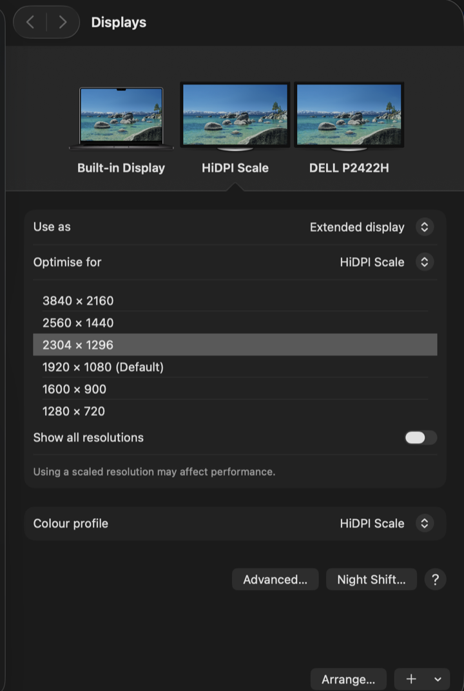

# hidpi-scale

Free flexible HiDPI scaling for external monitors on Apple-silicon Macs.

macOS caps most 1080p (and many other) monitors at their native "looks like"
resolution, so everything is big and there's no smaller option in System
Settings. Apps like BetterDisplay fix this behind a paid "flexible scaling"
feature. hidpi-scale does the same thing for free: pick a scale step and get
smaller UI and more screen space on the monitors you choose.

Here it is running on a 1080p DELL P2422H — macOS happily offering
2304×1296 and 2560×1440:



## Setup

Requires macOS on Apple silicon, [Homebrew](https://brew.sh), and Xcode Command
Line Tools (`xcode-select --install`).

```sh
npx github:ankithans/hidpi-scale
```

or manually:

```sh
git clone https://github.com/ankithans/hidpi-scale.git
cd hidpi-scale
./install.sh
```

Out of the box it targets the DELL P2422H. For other monitors, add a line to
`models.conf` (see below), then restart the daemon.

## Usage

```sh
~/.hidpi-scale/set-scale.sh medium   # 20% more space (default)
~/.hidpi-scale/set-scale.sh large    # 33% more space, smallest UI
~/.hidpi-scale/set-scale.sh small    # ~7% more space
~/.hidpi-scale/set-scale.sh native   # panel's normal size
~/.hidpi-scale/set-scale.sh 1296     # or a "looks like" height; snaps to a step
```

The size you pick is remembered and re-applied automatically.

## Choosing which monitors it affects

`models.conf` lists the monitors to scale, one per line, as
`vendor:model:panel-resolution` (decimal EDID ids):

```
4268:41413:1920x1080   # DELL P2422H
```

Only exact vendor+model matches are ever touched — every other display is
ignored. Any unit of a listed model works (useful when hot-desking). Find your
monitor's ids with BetterDisplay's display info panel or
`ioreg -lw0 | grep -A9 DisplayAttributes`. After editing, restart the daemon:
`launchctl kickstart -k gui/$(id -u)/com.hidpiscale`.

## How the automatic part works

- `vdisplay` is a small daemon (started at login by a LaunchAgent) that creates
  two headless virtual displays with HiDPI modes generated for each panel in
  `models.conf`, using the same private `CGVirtualDisplay` API that
  BetterDummy/DeskPad use.
- The daemon also watches macOS display-reconfiguration events. When the set of
  connected matched monitors changes — plug, unplug, dock, boot — it waits 3
  seconds for things to settle and runs `set-scale.sh`.
- `set-scale.sh` mirrors each matched monitor onto its own virtual display
  (explicitly, via `mirror`, so two identical monitors never merge into one
  mirror group). macOS renders the desktop at the virtual display's resolution
  and downscales it onto the panel. With one monitor connected, the spare
  virtual display is parked inside the same mirror set so no invisible desktop
  is left floating.

With two monitors, the first detected unit goes right of the built-in display
and the second goes left. To pin specific units to specific sides, create
`local.conf` next to the scripts (see `local.conf.example`).

## Notes

- The panel keeps its physical resolution — text gets smaller and slightly
  softer the higher you scale. "medium" is a good balance; bumping the
  monitor's own OSD sharpness helps.
- Supports up to two matched monitors at a time.
- Uses a private CoreGraphics API for the virtual displays; it may break in a
  future macOS release.

## Uninstall

```sh
~/.hidpi-scale/uninstall.sh
```

## License

MIT
